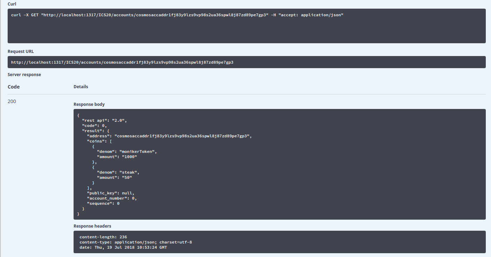
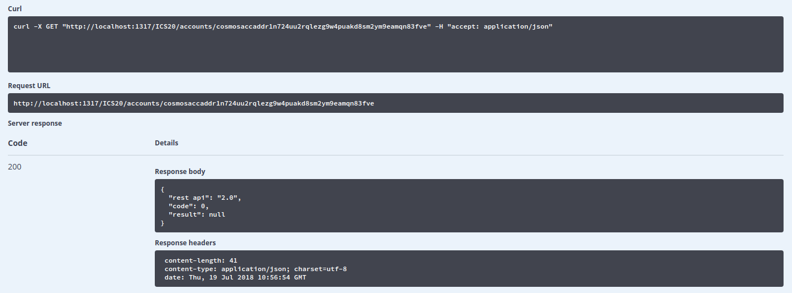
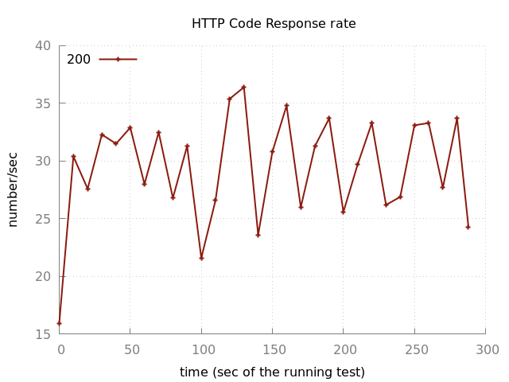
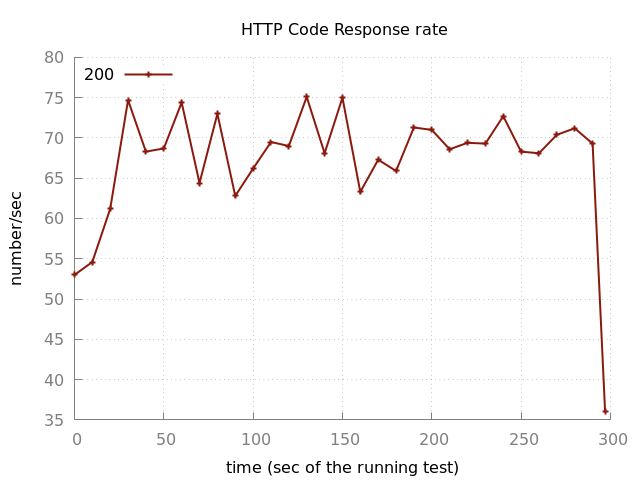
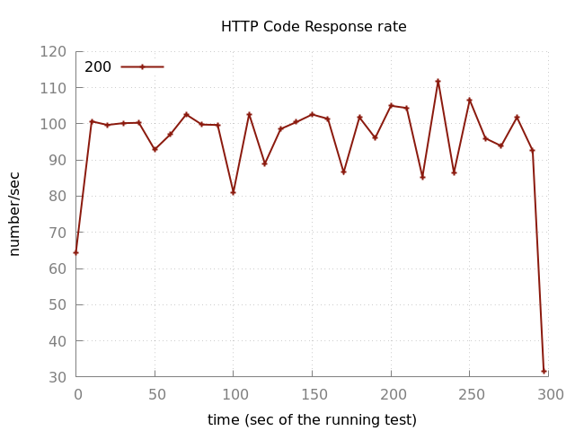
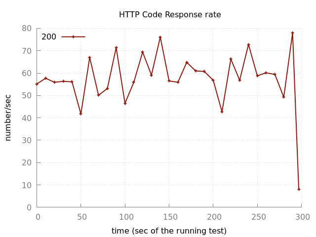
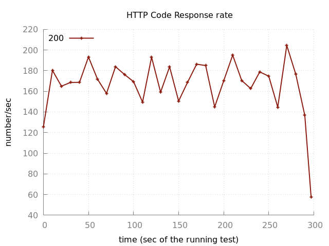
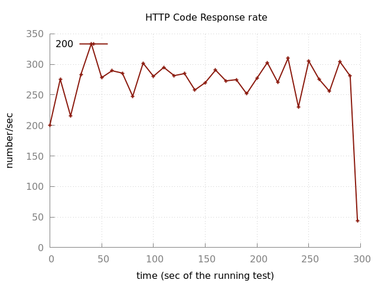
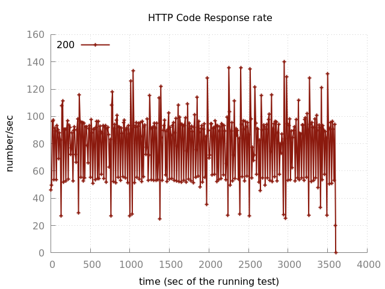

# Cosmos-LCD Test Report

## Test Purpose

* Functionality verification
* Test the stability of Cosmos-LCD
* Get the maximum TPS

## Test Environment

* Three validators on three server. Server configuration:
```
CPU: 2 cores
Memory: 4G
Public Bandwidth: 2Mb/s
Storage: mechanical hard disk
```
* Cosmos-LCD and test tool are on the same machine:
```
CPU: 4 cores
Memory: 8G
tsung version: 1.5.1
```

## Test Methods

Here we mainly care about the query APIs of Cosmos-LCD. Now Cosmos-LCD doesn't have full functionality. So we only test the token query API. All query APIs has similar process logic. From the perspective of gaia, the only difference is the store name and query key. So this API is very representative.

* Functionality test: Manualy call token query API in swagger-ui.
* Maximum TPS test: Use tsung to send requests at specific speed for 5 minutes, if no http error returns, then increate the speed, here we increate 20. Repeat this process until there is http error returned.
* Stability test: Use tsung to send requests at 80 percent of maximum speed for a hour. If no http error retruns, then the stability is OK.


## Test Result

#### Functionality test

* Query token with valid address which does have token:



* Query token with valid address which doesn't have token:



* Query token with invalid address


#### Maximum TPS test

Here I only post the test result of the maximum TPS at specific conditions.

* Distrust mode, only connect to one full node:

|Name    | highest 10sec mean | lowestowest 10sec mean | Highest Rate | Mean Rate  | Mean     |Count |
|------- |--------------------|----------------------- |------------- |----------- |--------- |----- |
|request | 4.51 sec           | 0.63 sec               | 36.4 / sec  | 30.12 / sec| 2.44 sec |8589 |



* Distrust mode, connect to two full node:

|Name    | highest 10sec mean | lowestowest 10sec mean | Highest Rate | Mean Rate  | Mean     |Count |
|------- |--------------------|----------------------- |------------- |----------- |--------- |----- |
|request | 4.88 sec           | 1.69 sec               | 75.1 / sec  | 68.08 / sec| 3.49 sec |20441 |



* Distrust mode, connect to three full node:

|Name    | highest 10sec mean | lowestowest 10sec mean | Highest Rate | Mean Rate  | Mean     |Count |
|------- |--------------------|----------------------- |------------- |----------- |--------- |----- |
|request | 1.96 sec           | 0.92 sec               | 111.9 / sec  | 96.08 / sec| 1.38 sec |29018 |



* Trust mode, only connect to one full node:

|Name    | highest 10sec mean | lowestowest 10sec mean | Highest Rate | Mean Rate  | Mean     |Count |
|------- |--------------------|----------------------- |------------- |----------- |--------- |----- |
|request | 0.73 sec           | 12.38  msec               | 78 / sec  | 57.58 / sec| 0.45 sec |17712 |



* Trust mode, connect to two full node:

|Name    | highest 10sec mean | lowestowest 10sec mean | Highest Rate | Mean Rate  | Mean     |Count |
|------- |--------------------|----------------------- |------------- |----------- |--------- |----- |
|request | 1.22 sec           | 52.66 msec               | 204.5 / sec  | 96.08 / sec| 0.62 sec |50967 |



* Trust mode, connect to three full node:

|Name    | highest 10sec mean | lowestowest 10sec mean | Highest Rate | Mean Rate  | Mean     |Count |
|------- |--------------------|----------------------- |------------- |----------- |--------- |----- |
|request | 1.49 sec           | 0.23 sec               | 333.9 / sec  | 271.63 / sec| 0.87 sec |82872 |



#### Stability test

* distrust mode, connect to three full node, 80 requests per second:



## Analysis

Mean TPS on different condition.

|Mode         | one full node | two full node | three full node |
|------------ |-------------- |-------------- |---------------- |
|distrust mode| 36.4 sec      | 75.1 sec      | 111.9 / sec     |
|trust mode   | 78 sec        | 204.5 sec     |  333.9 / sec     |

Comparing with distrust mode, Cosmos-LCD has much better TPS in trust mode. The reason is very obvious. In trust mode, full nodes don't need to build proof and return proof which reduce request processing complexity and decrease network traffic. In addition, cosmos-LCD also doesn't need to verify proof. So the whole request processing is much more fast.

According to the above table, trying to connect to more full nodes can help to improve Cosmos-LCD TPS significantly. So in productive environment, users should specify as many as possible full nodes for Cosmos-LCD.

From the perspective of full node, processing query request is disk I/O intensive operation, especially for distrust mode, because full node need to access database twice, one for query data and IAVL proof, another for getting multistore commit information. So SSD may be very helpful for improving query effiency. 

From the perspective of Cosmos-LCD, when in distrust mode, it requires much computing resource for signature verfication and hash calculation. So using better CPU and more memory may improve TPS too.

Bandwitdh may also affect the TPS a lot, especially for distrust mode. Here the bandwidth is only 2Mb/s, which is very poor. But we didn't try to deploy Cosmos-LCD and full nodes in the same local network to acquire more bandwidth, because in real use cases, Cosmos-LCD has to connect to full nodes throught global network. In real use case, users should try to acquire more bandwidth and try to deploy Cosmos-LCD as closet as possible to full nodes.
