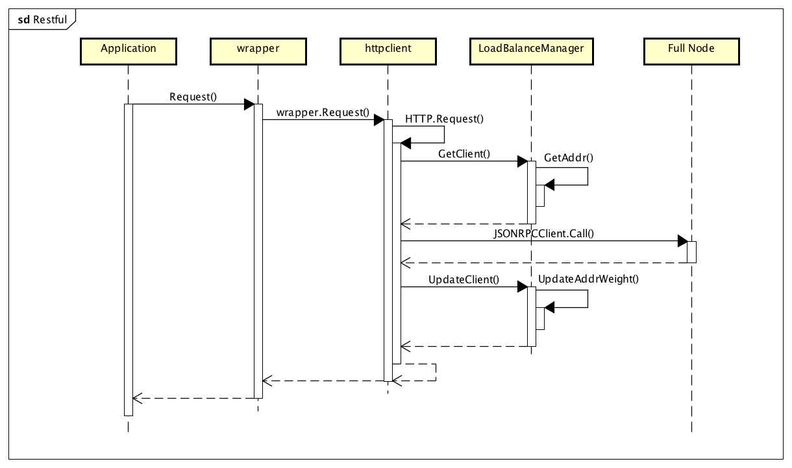

# LoadBalance 

This package is designed for the load balancing problem. Because the CosmosSDK LCD will connect with many servers in the future. It is bound to need a load balancing function that improves the distribution of workloads across many full nodes.

## Design
This package need combine with client to realize the real load balancing. It can embed into the `HTTP`(Loc:"github.com/tendermint/tendermint/rpc/lib/client/httpclient.go"). In other words，we realize the new httpclient based on `HTTP`.

From:

```go
type HTTP struct {
	remote string
	rpc    *rpcclient.JSONRPCClient
	*WSEvents
}
```
To:

```go
type HTTPLoadBalance struct {
	mgr BalanceMgr
	rpcs   map[string]*rpcclient.JSONRPCClient
	currpc *rpcclient.JSONRPCClient
	*WSEvents
}
```
* `mgr`：It is the realization of the load balancing and contains all the addresses. `mgr.GetAddr(name string)` get the remote address to serve the current request by the load balancing algorithm that is decided by the `name`.
* `rpcs`：It mapped the string of the remote address to the `rpcclient.JSONRPCClient`.
* `rpc`: the current working rpcclient

### The Diagram of LCD RPC WorkFlow with LoadBalance


In the above sequence diagram, application calls the `Request()`, and LCD finally call the `HTTP.Request()` through the SecureClient `Wrapper`. In every `HTTP.Request()`,`Getclient()` selects the current working rpcclient by the load balancing algorithm,then run the `JSONRPCClient.Call()` to request from the Full Node, finally `UpdateClient()` updates the weight of the current rpcclient according to the status that is returned by the full node. 
### Add the remote address
### Delete the remote address
### Update the weights of the addresses
### Load balancing Strategies
We can design some strategies like nginx to combine the different load balancing algorithms to get the final remote. We can also get the status of the remote server to add or delete the addresses and update weights of the addresses.

In a word，it can make the entire LCD work more effective in actual conditions.

## Interface And Type

### Balancer
>in `balance/balance.go`

This interface `Balancer`is the core of the package. Every load balancing algorithm should realize it,and it defined two interfaces.

* `init` initialize the balancer, assigns the variables which `DoBalance` needs.
* `DoBalance` load balance the full node addresses according to the current situation. 

```go
package balance

type  Balancer interface {
	 init(NodeAddrs)
     DoBalance(NodeAddrs) (*NodeAddr,int,error)
}
```

###NodeAddr

>in `balance/types.go`

* host: ip address
* port: the number of port
* weight: the weight of this full node address,default:1

This NodeAddr is the base struct of the address.

```go
type NodeAddr struct{
	host string
	port int
	weight int
}
func (p *NodeAddr) GetHost() string 
func (p *NodeAddr) GetPort() int 
func (p *NodeAddr) GetWeight() int 
func (p *NodeAddr) updateWeight(weight int)
```
The `weight` is the important factor that schedules which full node the LCD calls. The weight can be changed by the information from the full node. So we have the function `updateWegiht`.

###NodeAddrs
>in `balance/types.go`

`NodeAddrs` is the list of the full node address. This is the member variable in the BalanceManager(`BalancerMgr`)

```go
type NodeAddrs []*NodeAddr
```
## Load Balancing Algrithm
### Random
>in `balance/random.go`

### RandomWeight
>in `balance/random.go`

### RoundRobin
>in `balance/roundrobin.go`

### RoundRobinWeight
>in `balance/roundrobin.go`

### Hash
> **Todo**


## Load Balancing Manager
### BalanceMgr
>in `balance/manager.go`

* addrs: the list of 
* balancers: 
* change: 

`BalanceMgr` is the manager of many balancer. It is the access of load balancing. Its main function is to maintain the `NodeAddrs` and to call the specific load balancing algorithm above.

```go
type BalanceMgr struct{
	addrs NodeAddrs
	balancers map[string]Balancer
	change map[string]bool
}
```
